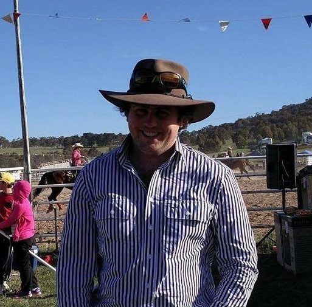
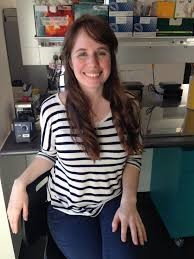

### Cericia (Cici) Martinez

Cici is a postdoc working with CSIRO Mineral Resources within the Deep Earth Imaging Future Science Platform.

Ask her about [Tingles](https://en.wikipedia.org/wiki/Eucalyptus_jacksonii).

### Morgan Williams <a href="https://twitter.com/metasomite"><i class="fa fa-twitter" aria-hidden="true"></i></a>

Morgan is a postdoc working in geoscience analytics for CSIRO Mineral Resources.
He likes woodworking and strong coffee. He looks for opportunities to make
everyday life easier and the way we work more efficient so we can invest our time
into more important things.

One day he'll build a log cabin.

### Lara Bereza-Malcolm <a href="https://twitter.com/LBerezaMalcolm"><i class="fa fa-twitter" aria-hidden="true"></i></a>
