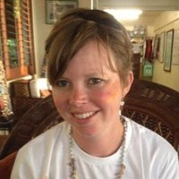
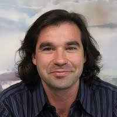
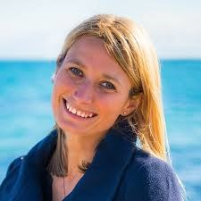

### Dr. Sophie Hancock

Sophie has 14 years global experience in multinational mining, junior exploration and consulting. Drawing on industry and collaborative experience, Sophie is interested in addressing the diversity of technical challenges of the resources industry. She has experience delivering successful technical geoscience, education and mentoring programs collectively in applied research and education.

### Dr. Ignacio Gonzalez-Alvarez

Ignacio did his BSc. and MSc. specializing on stratigraphy and basin analysis at the University of Oviedo, Spain; and did his PhD at the University of Saskatchewan, Canada, on geochemistry, on trace element mobility in sedimentary rocks. Ignacio worked in Industry in Europe, Australia and the University of Western Australia for several years leading research and exploration projects in four continents, and today he is the Leader for the Sedimentary basins Team in CSIRO). His work at CSIRO involves the coordination of a diverse portfolio of multi-disciplinary projects and data integration in different regions in Australia, as well as projects in Papua New Guinea, Europe, India and South America.

### Dr. Anais Pages

